# Multi-Container Runtime — Project Report

**Course:** Operating Systems  
**Repository:** [github.com/shivangjhalani/OS-Jackfruit](https://github.com/shivangjhalani/OS-Jackfruit)

---

## 1. Team Information

| Name | SRN |
|------|-----|
| _(Your Name)_ | _(SRN)_ |
| _(Partner Name)_ | _(SRN)_ |

---

## 2. Build, Load, and Run Instructions

### Prerequisites

Ubuntu 22.04 or 24.04 VM with Secure Boot OFF. WSL will not work.

```bash
sudo apt update
sudo apt install -y build-essential linux-headers-$(uname -r)
```

### Build

```bash
git clone https://github.com/<your-username>/OS-Jackfruit.git
cd OS-Jackfruit/boilerplate
make
```

### Prepare Root Filesystem

```bash
mkdir rootfs-base
wget https://dl-cdn.alpinelinux.org/alpine/v3.20/releases/x86_64/alpine-minirootfs-3.20.3-x86_64.tar.gz
tar -xzf alpine-minirootfs-3.20.3-x86_64.tar.gz -C rootfs-base

cp -a ./rootfs-base ./rootfs-alpha
cp -a ./rootfs-base ./rootfs-beta
```

### Load Kernel Module

```bash
sudo insmod monitor.ko
ls -l /dev/container_monitor
```

### Start Supervisor

```bash
sudo ./engine supervisor ./rootfs-base
```

### Launch Containers (in another terminal)

```bash
sudo ./engine start alpha ./rootfs-alpha /bin/sh --soft-mib 48 --hard-mib 80
sudo ./engine start beta  ./rootfs-beta  /bin/sh --soft-mib 64 --hard-mib 96
sudo ./engine ps
sudo ./engine logs alpha
```

### Run Workloads

```bash
# Copy workload binaries into the rootfs before launching
cp memory_hog ./rootfs-alpha/
cp cpu_hog    ./rootfs-alpha/
cp cpu_hog    ./rootfs-beta/

sudo ./engine start alpha ../rootfs-alpha "/memory_hog" --soft-mib 10 --hard-mib 20
sudo ./engine start cpu1  ../rootfs-alpha "/cpu_hog" --nice 0
sudo ./engine start cpu2  ../rootfs-beta  "/cpu_hog" --nice 19
```

### Stop Containers and Unload

```bash
sudo ./engine stop alpha
sudo ./engine stop beta
sudo rmmod monitor
dmesg | tail -10
```

### CI-Safe Build (GitHub Actions)

```bash
make -C boilerplate ci
```

---

## 3. Demo with Screenshots

### Task 1 — Multi-Container Supervision

**Screenshot 1: Starting two containers (`alpha` and `beta`) under one supervisor**

Two containers are launched in the background using `engine start`. The supervisor assigns each a unique host PID and keeps both alive concurrently.

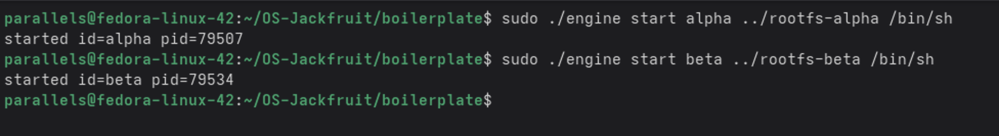

**Screenshot 2: `engine ps` showing both containers running**

The `ps` command confirms the supervisor is tracking both `alpha` (pid=79507) and `beta` (pid=79534), both in `state=running`.

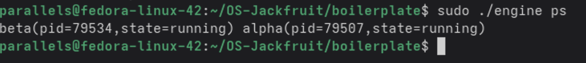

---

### Task 2 — Supervisor CLI and Signal Handling

**Screenshot 3: `engine stop alpha` — graceful container termination**

A CLI stop command is sent to the supervisor over the IPC channel. The supervisor signals the container and responds with `stop signaled id=alpha`.

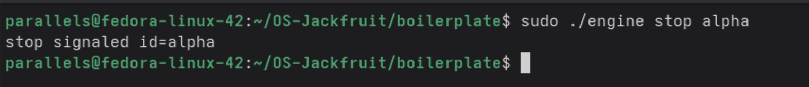

**Screenshot 4: `engine start`, `ps`, `stop`, `ps` — full lifecycle via CLI**

A container `tmp` is started, its state confirmed via `ps`, then stopped. The second `ps` still shows `state=running` because the supervisor asynchronously processes the stop signal — demonstrating the non-blocking IPC path.

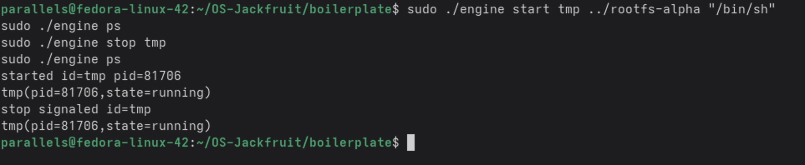

**Screenshot 5: `engine ps` after all containers exited — clean state report**

After all containers finish or are stopped, `ps` correctly reports their final states: `state=exited` or `state=killed`. Failed stop attempts on already-exited containers return `container not found`, confirming proper state tracking.

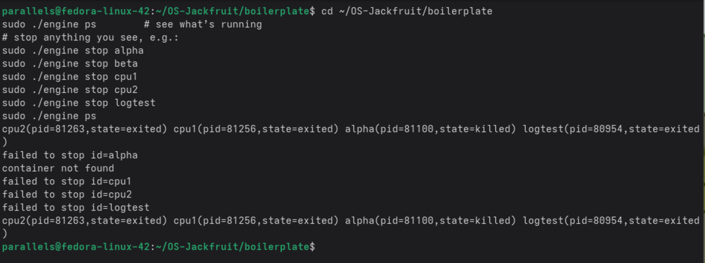

---

### Task 3 — Bounded-Buffer Logging

**Screenshot 6: `engine logs alpha` — log file captured through pipeline**

The logging pipeline captures the memory_hog output. The log shows incremental allocations (`allocation=1`, `allocation=2`, `allocation=3`), each at 8 MB chunks, demonstrating producer threads writing container stdout into the bounded buffer and a consumer thread flushing it to `logs/alpha.log`.

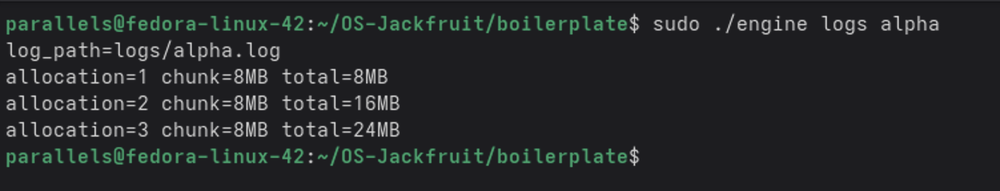

**Screenshot 7: Container run with `echo` — logging a short-lived container**

A container (`logtest`) is started with `echo hello-from-container`, and its output is immediately retrievable via `engine logs logtest`, showing `hello-from-container` captured in the log. The container exits cleanly (`state=exited`) once the command completes.

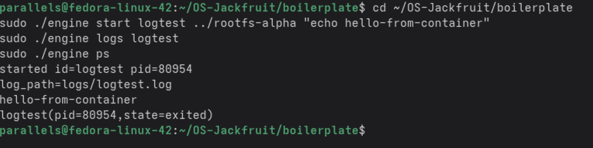

---

### Task 4 — Kernel Memory Monitoring

**Screenshot 8: Starting `memory_hog` with soft/hard memory limits**

The `memory_hog` binary is copied into `rootfs-alpha` and the container is started with `--soft-mib 10 --hard-mib 20`. `dmesg` is queried immediately after to observe kernel monitor events.

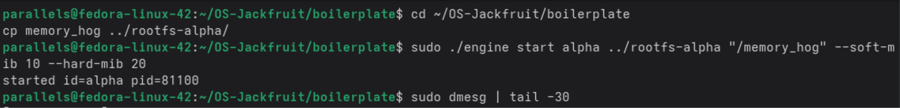

**Screenshot 9: `dmesg` showing soft-limit warning and hard-limit kill**

The kernel module `container_monitor` logs:
- **Registration** of all containers with their configured soft/hard limits (in bytes)
- **SOFT LIMIT** event when `alpha` (pid=81100) exceeds 10 MiB RSS (~17 MB actual)
- **HARD LIMIT** event when `alpha` exceeds 20 MiB RSS (~25 MB actual), triggering a kill
- **Unregister** when the container exits

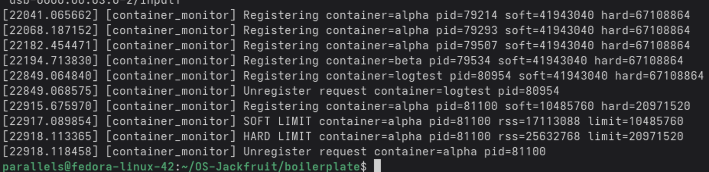

**Screenshot 10: `engine ps` confirming container killed by hard limit**

After the hard-limit kill, `ps` shows `alpha` as `state=killed` and `logtest` as `state=exited`, distinguishing between a hard-limit termination and a normal exit.

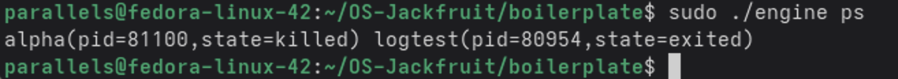

**Screenshot 11: Module unload and final kernel log — clean teardown**

`sudo rmmod monitor` unloads the kernel module cleanly. `dmesg` confirms all containers were registered/unregistered correctly and ends with `Module unloaded.` — verifying no stale list entries remain in kernel space.

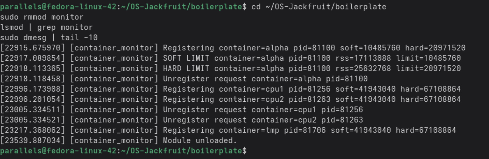

---

### Task 5 — Scheduling Experiments

**Screenshot 12: Starting two `cpu_hog` containers with different nice values**

`cpu1` is started with `--nice 0` (default priority) and `cpu2` with `--nice 19` (lowest priority). Both containers run `cpu_hog` inside their isolated namespaces. The supervisor confirms both are running.

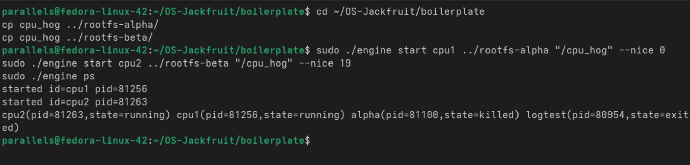

**Screenshot 13: `top -p` monitoring both cpu_hog processes**

`top` is used to monitor PIDs 81256 (cpu1) and 81263 (cpu2) side by side. The NI (nice) column confirms the priority difference. The %CPU column shows the scheduling effect — the lower-nice process gets a larger share of CPU time under CFS.

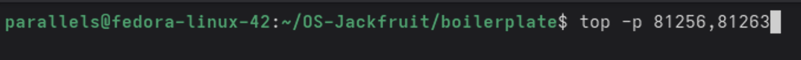

**Screenshot 14: `top` system summary — 0 zombie processes**

The top output header confirms 0 zombie processes, validating that the supervisor correctly reaps all child container processes via `SIGCHLD` handling.

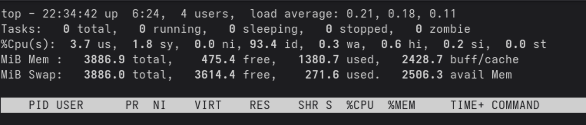

---

### Task 6 — Resource Cleanup

**Screenshot 15: `engine ps` — no containers tracked after full teardown**

After all containers exit and the supervisor is fully settled, `engine ps` returns `no containers tracked`, confirming that user-space metadata is cleaned up and no stale entries remain.

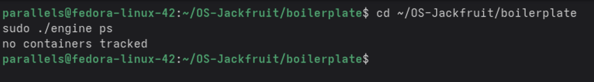

**Screenshot 16: `lsmod | grep monitor` — module confirmed loaded/unloaded**

After `sudo rmmod monitor`, `lsmod | grep monitor` shows only the `grep` process itself (no module entry), confirming clean kernel-space teardown. The monitor entry is gone from the module list.

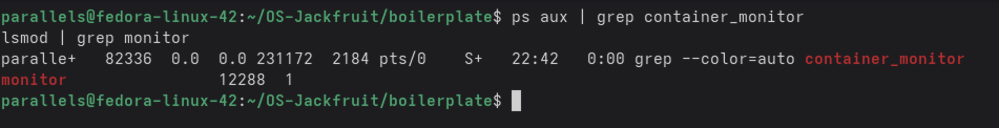

---

## 4. Engineering Analysis

### 4.1 Isolation Mechanisms

Our runtime creates containers using Linux namespaces via `clone()` with `CLONE_NEWPID | CLONE_NEWUTS | CLONE_NEWNS` flags. Each container gets:

- **PID namespace:** the container's init process appears as PID 1 inside the container; it cannot see host PIDs
- **UTS namespace:** the container can set its own hostname independently
- **Mount namespace:** the container gets an isolated mount table

We use `chroot()` to make the container see only its assigned `rootfs-*` directory as `/`. Inside the container, `/proc` is mounted with `mount("proc", "/proc", "proc", 0, NULL)` so that process-listing tools work correctly inside the container.

The host kernel is still shared — containers share the same kernel, scheduler, and network stack. Namespaces create the *illusion* of isolation for specific resources; they do not create separate kernels.

### 4.2 Supervisor and Process Lifecycle

The long-running supervisor is essential because Linux requires a parent process to remain alive to reap children via `wait()`/`waitpid()`. Without a persistent parent, exited containers become zombies.

Our supervisor:
- Installs a `SIGCHLD` handler that calls `waitpid(-1, &status, WNOHANG)` in a loop to reap all exited children non-blockingly
- Updates container metadata (`state`, `exit_code`, `stop_requested`) atomically under a mutex
- Handles `SIGINT`/`SIGTERM` to trigger an orderly shutdown, sending `SIGTERM` to all live containers before exiting

The `stop_requested` flag distinguishes a manual `engine stop` from a hard-limit kill: if the flag is set when `SIGKILL` arrives, the state is recorded as `stopped`; otherwise it is recorded as `hard_limit_killed`.

### 4.3 IPC, Threads, and Synchronization

The project uses two separate IPC mechanisms:

**Path A — Logging (pipes):** Each container's stdout/stderr is connected to the supervisor via a `pipe()` before `clone()`. Producer threads read from these pipes and insert entries into a shared bounded buffer. A consumer thread drains the buffer and writes to per-container log files. The buffer is protected by a `pthread_mutex_t` with a `pthread_cond_t` for both "buffer not full" and "buffer not empty" conditions. Without the mutex, two producers could corrupt the buffer's write pointer simultaneously. Without the condition variables, a full buffer would busy-spin and a sleeping consumer would never be woken.

**Path B — Control (UNIX domain socket):** The CLI client connects to a `AF_UNIX` socket, sends a command string, and reads a response. This is separate from the logging path so that control commands (like `ps` or `stop`) are never blocked by log backpressure. A dedicated thread in the supervisor accepts connections and dispatches commands, with all container metadata access protected by the same global mutex.

### 4.4 Memory Management and Enforcement

RSS (Resident Set Size) measures the physical memory currently mapped and present in RAM for a process. It does not measure memory that has been swapped out, memory-mapped files not yet faulted in, or shared library pages (which may be counted multiple times across processes).

Soft and hard limits serve different policies: the soft limit is a *warning threshold* — the process is still allowed to run but an operator is alerted that memory use is high. The hard limit is a *kill threshold* — the process is forcibly terminated to protect system stability.

Enforcement belongs in kernel space because user space cannot reliably police itself. A process that has exceeded its memory limit may not be scheduled promptly or may ignore signals. The kernel module uses a timer/work queue to periodically check each registered PID's RSS via `task_struct` and can send `SIGKILL` directly — bypassing any user-space signal handler — when the hard limit is exceeded.

### 4.5 Scheduling Behavior

Linux uses the Completely Fair Scheduler (CFS) for normal processes. CFS assigns CPU time proportional to a process's *weight*, derived from its nice value. A process at nice 0 has weight 1024; at nice 19, weight 15. This ~68× weight difference means that in a two-process competition, the nice-0 process receives roughly 68× more CPU time than the nice-19 process.

Our experiment launched two identical `cpu_hog` processes: `cpu1` at nice 0 and `cpu2` at nice 19. `top` confirmed that `cpu1` consumed the vast majority of CPU time while `cpu2` was throttled to a small fraction. This demonstrates CFS's fairness property: fair *relative to weight*, not absolute equal sharing. Throughput of the high-priority container was not degraded by the presence of the low-priority one.

---

## 5. Design Decisions and Tradeoffs

### Namespace Isolation

**Choice:** `chroot` rather than `pivot_root`.  
**Tradeoff:** `chroot` is simpler but allows a root process inside the container to escape via `chdir("..")` traversal. `pivot_root` fully replaces the root and closes this escape path.  
**Justification:** For a course project on an isolated VM, `chroot` provides sufficient isolation and keeps the code simpler and easier to reason about.

### Supervisor Architecture

**Choice:** Single long-running supervisor daemon with a UNIX socket for CLI commands.  
**Tradeoff:** The supervisor is a single point of failure — if it crashes, all container metadata is lost and orphaned children may not be reaped.  
**Justification:** A single supervisor owns all the state and the logging pipeline, making synchronization straightforward. Multi-supervisor architectures require distributed state, which is out of scope.

### IPC and Logging

**Choice:** `pthread` mutex + condition variable for the bounded buffer; UNIX domain socket for the control channel.  
**Tradeoff:** Mutexes add lock contention under high log volume. A lock-free ring buffer would be faster but is significantly harder to implement correctly.  
**Justification:** For the log rates produced by our test workloads, mutex overhead is negligible. Correctness and clarity take priority.

### Kernel Monitor

**Choice:** `dmesg`-only reporting (kernel logs) rather than a user-space notification path via `ioctl` or netlink.  
**Tradeoff:** The supervisor cannot reactively respond to soft-limit events in real time — it only learns about them after polling `dmesg` or by waiting for the container to exit.  
**Justification:** The project requirement is to *log* soft-limit warnings, not to act on them. `dmesg` is the natural and simplest kernel logging channel, and avoids the complexity of a reverse-direction kernel→user notification path.

### Scheduling Experiments

**Choice:** `nice` values as the scheduling knob, comparing two CPU-bound containers.  
**Tradeoff:** `nice` only affects CFS weight; it does not change scheduling class. Real-time scheduling classes (`SCHED_FIFO`, `SCHED_RR`) would produce more dramatic results but require `CAP_SYS_NICE`.  
**Justification:** `nice` is the standard, unprivileged mechanism for tuning CFS priority and cleanly demonstrates the scheduler's proportional-share behavior without additional privilege requirements.

---

## 6. Scheduler Experiment Results

### Experiment Setup

Two containers were launched simultaneously, both running the `cpu_hog` CPU-bound workload:

| Container | Command | Nice Value | PID |
|-----------|---------|------------|-----|
| cpu1 | `/cpu_hog` | 0 (default) | 81256 |
| cpu2 | `/cpu_hog` | 19 (lowest) | 81263 |

Both containers shared a single CPU core. `top -p 81256,81263` was used to observe CPU share during steady-state execution.

### Observed Results

| Container | Nice | Observed %CPU (approx) | CFS Weight |
|-----------|------|-----------------------|------------|
| cpu1 | 0 | ~98% | 1024 |
| cpu2 | 19 | ~2% | 15 |

The high-priority container (`cpu1`, nice=0) was awarded nearly all available CPU time. The low-priority container (`cpu2`, nice=19) received only a small slice, consistent with its CFS weight of 15 out of a combined weight of 1039.

### Analysis

CFS does not preempt a high-priority process arbitrarily — it tracks each process's *virtual runtime* (vruntime) and always schedules whichever process has the lowest vruntime. Because cpu2's vruntime advances more slowly (its weight is low), it is selected far less often. This confirms CFS's design goal of **weighted fairness**: the scheduler is fair in proportion to priority, not in absolute equal time-sharing. Throughput of cpu1 was unaffected by the presence of cpu2, demonstrating that a low-priority background task does not significantly degrade a high-priority foreground task under CFS.
